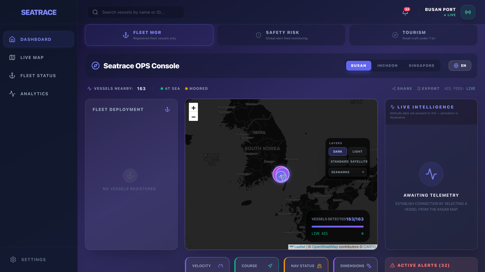
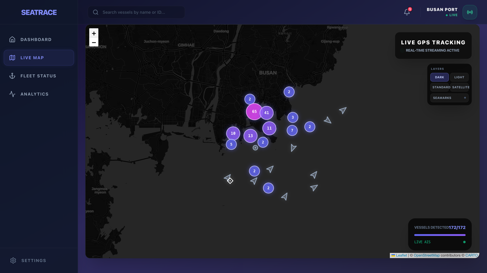
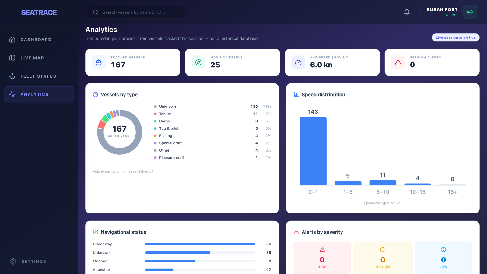

# Language Selection / 언어 선택 / 言語選択

문서 조회를 위해 원하는 언어를 선택하면 됨:

- [English](README.md)
- **[한국어](README.ko.md)**
- [日本語](README.ja.md)

---

# SEATRACE — AI Maritime Monitoring System

실제 전 세계 AIS 데이터 기반 해상 선박 관제 인터페이스임. (초기의 "디지털 트윈" 표현은 의도적으로 버렸음 — 3D 뷰는 AIS가 실제로 방송하는 값만 그림.)


**개발 기간:** 2026.02 ~ 2026.03 · **개발 인원:** 1인 (설계 · 프론트 · 프록시 서버 · 해사 알고리즘)

**🔗 라이브 데모:** [vts-tau-navy.vercel.app](https://vts-tau-navy.vercel.app)

> 프록시가 Render 무료 티어에서 돌기 때문에 유휴 시 잠들어 있음. 첫 접속 시
> 깨어나는 동안 실시간 선박이 뜨기까지 최대 1분 정도 걸릴 수 있음.



<table>
<tr>
<td width="50%"></td>
<td width="50%"></td>
</tr>
<tr>
<td align="center"><b>라이브 맵</b> — 픽셀 격자 클러스터링과 방위 회전 마커</td>
<td align="center"><b>분석</b> — 현재 세션에서 추적한 선박 집계</td>
</tr>
</table>

> 위 화면의 모든 숫자는 캡처 시점의 실제 AISStream 피드에서 나온 값임 — 목업 없음.

## 🚢 프로젝트 개요

**실제 전 세계 AIS(Automatic Identification System) 실시간 데이터**를 기반으로 한 선박 관제 인터페이스임(모의 데이터 아님). AISStream.io의 위치 스트림을 Node 프록시를 거쳐 받고, 클라이언트에서 충돌 위험(CPA/TCPA)을 계산해 Leaflet 지도와 Three.js 3D 뷰에 수백 척을 렌더링함.

핵심 과제는 **초당 수백 건으로 들어오는 스트림을 브라우저가 렌더링할 수 있는 속도로 낮추는 것**이었고, 프록시 → 스트림 → 스토어 → 렌더 4계층 부하 제어 파이프라인으로 해결했음.

## 🌟 주요 기능

1. **실시간 AIS 지도 인터페이스**
   - 선박의 Heading 데이터를 기반으로 한 사용자 정의 마커 회전 시스템
   - 선박 항적(최근 이동 경로) 시각화와 침로 벡터 표시
   - 위험 등급별 색상(safe / warning / danger)과 지오펜싱(제한 수역) 하이라이트

2. **3D 선박 뷰**
   - Three.js 및 React Three Fiber 기반 3D 선박 렌더링
   - 실제 수신되는 방위(heading)와 속도를 Lerp 보간으로 부드럽게 반영
   - 참고: AIS 규격에는 pitch/roll 정보가 없으므로, 3D 뷰는 실제로 수신되는 값만 반영함

3. **충돌 위험 분석 (CPA/TCPA)** — *공식이 아니라 그 공식을 감싸는 부분이 본체*
   - CPA/TCPA는 상대속도 벡터의 2차식이라 **구현은 15줄**. 시간을 쓴 곳은 실데이터로 감쌌을 때 틀리는 지점들임
   - **좌표계** — 위경도를 그대로 빼면 부산(35°N)에서 동서 거리를 **22% 과대평가**함. 경도차에 `cos(기준 위도)`를 적용해 미터로 보정. **경도 0.005°는 실제 455m인데 무보정 시 556m로 계산돼 danger를 통째로 놓침**
   - **수치 예외** — 같은 침로·속력이면 상대속도가 0이라 TCPA 분모가 소멸. **상대속도 제곱이 `1e-6` 미만이면 현재 거리로 대체**
   - **오경보 차단** — TCPA 부호와 시간 지평을 함께 판정. **최근접점을 통과한 배는 50m 옆이라도 safe**
   - **결측값 날조 금지** — COG·heading이 둘 다 없으면(Class-B에 흔함) **0°를 기본값으로 쓰지 않고 정지로 간주**. "진북 항해 중"이라는 허구의 벡터를 차단함
   - **경보 플래핑 억제** — **진입 500m / 해제 650m 슈미트 트리거** + **강등에만 20초 유예(승격은 즉시)**. 켜지는 건 빨라야 하고 꺼지는 건 느려야 함 (warning 등급도 CPA 1,500m · TCPA 12분 지평에 같은 방식으로 적용됨)
   - **검증** — 판정 로직을 렌더링과 무관한 **순수 함수**로 분리하고 항해 조우 상황을 **골든 케이스**로 고정. **Vitest 36개 통과**
   - 2초 주기 CPA/TCPA 스캔(본선 기준 O(n))

4. **지오펜싱**
   - 부산 제한 수역 진입 시 자동 알림 — 진입 선박은 **주황색 외곽선·글로우**로 즉시 구분됨

5. **운영 모드**
   - Fleet / Safety / Marina 모드 전환 — 각각 등록 함대 필터, 전역 알림 피드 모니터링, 7노트 미만 소형선 필터
   - Analytics는 과거 데이터가 아니라 현재 세션 집계이며, 화면에도 그렇게 명시함

6. **고성능 상태 관리**
   - Zustand 셀렉터 구독 + copy-on-write 갱신
   - 1초 배치 flush, 화면별 800~1,200ms 스냅샷 스로틀 + `startTransition`
   - 뷰포트 컬링 → 마커 250개 상한 → 줌 12 미만 픽셀 격자 클러스터링
   - 마커 이동은 공유 rAF 티커로 보간, **React 리렌더 0회**

7. **글로벌 지원**
   - i18next를 활용한 한국어, 영어, 일본어 다국어 지원 (브라우저 언어 자동 감지)

## 🛠 기술 스택

- **프레임워크**: React 19, TypeScript 5.9, Vite 7
- **상태 관리**: Zustand 5 (셀렉터 기반 구독)
- **시각화**:
  - **Map**: Leaflet, React-Leaflet
  - **3D**: Three.js, @react-three/fiber, @react-three/drei
- **백엔드(프록시)**: Node.js, Express 5, `ws` — API 키 은닉·AIS 필드 정규화·캐시·레이트리밋
- **스타일링**: Tailwind CSS, Lucide React
- **데이터 소스**: AISStream.io (전 세계 실시간 AIS WebSocket)
- **국제화**: i18next (한국어 · 영어 · 일본어)
- **테스트**: Vitest — 해상 수학·위험 등급 판정 순수 함수 단위 테스트 36개 (`npm test`)

## 📂 프로젝트 구조

```text
seatrace/
├── server/
│   └── proxy.js          # AIS 프록시: 키 은닉·정규화·캐시·레이트리밋
├── src/
│   ├── store/
│   │   ├── aisStream.ts  # WebSocket 클라이언트·배치·재접속·구독 관리
│   │   ├── useShipStore.ts # Zustand 스토어 + CPA/지오펜스 위험도 계산
│   │   ├── shipTypes.ts  # 도메인 타입 정의
│   │   ├── config.ts     # 튜닝 상수 (한 곳에 모아 조정 가능)
│   │   └── persistence.ts # localStorage 웜 캐시·설정·함대
│   ├── components/
│   │   ├── 3d/           # Three.js / React Three Fiber (Ship, Scene)
│   │   ├── dashboard/    # ModeSwitcher, StatsBar, Alerts
│   │   ├── layout/       # App 레이아웃, Sidebar, Header
│   │   └── map/          # Leaflet 지도·마커·클러스터·rAF 보간
│   ├── hooks/
│   │   └── useShipSnapshot.ts # 렌더 스로틀링 훅
│   ├── utils/
│   │   ├── maritimeMath.ts      # 해상 수학 (CPA/TCPA, latLngToXY, cogSogToVelocity)
│   │   ├── riskGrading.ts       # 위험 등급 판정 (슈미트 트리거 + 강등 유예)
│   │   ├── maritimeMath.test.ts # 조우 상황 골든 케이스
│   │   └── riskGrading.test.ts  # 플래핑·비대칭 전이 테스트
│   ├── constants/        # 번역 (i18n)
│   ├── i18n.ts           # i18next 설정 및 언어 감지
│   └── pages/            # Dashboard, LiveMap, FleetStatus, Analytics, Settings
├── public/
└── .env                  # AISSTREAM_API_KEY (서버 전용, git 추적 제외)
```

## 🚀 시작 가이드

1. 저장소를 복제함.

   ```bash
   git clone https://github.com/JINWORLD13/sea.git
   ```

2. 종속성을 설치함.

   ```bash
   npm install
   ```

3. 환경 변수를 설정함. (.env)

   ```
   AISSTREAM_API_KEY=your_api_key_here
   ```

   > `VITE_AISSTREAM_API_KEY`가 **아니라** `AISSTREAM_API_KEY`를 사용해야 함.
   > Vite는 `VITE_` 접두사가 붙은 변수를 클라이언트 번들에 그대로 인라인하므로,
   > 개발자 도구를 여는 누구에게나 키가 노출됨. 키가 필요한 건 프록시 프로세스뿐이며,
   > 프록시는 `VITE_` 접두사 이름을 아예 읽지 않도록 되어 있음.

   > 포트는 양쪽 모두 8080이 기본임. 8080이 이미 사용 중이면 `PROXY_PORT`와
   > `VITE_PROXY_PORT`를 **같은 값**(예: 8081)으로 함께 설정해야 함 — 앞은 프록시
   > 포트를 옮기고, 뒤는 프론트가 접속할 포트를 알려줌.

4. 프론트엔드와 프록시 서버를 함께 실행함.

   ```bash
   npm run dev
   ```

### 데이터 흐름

**프론트 ↔ 프록시 서버 ↔ AISStream** — WebSocket 쌍방향 통신임. 프론트에서 구독 요청(예: BoundingBoxes)을 서버로 보내면 서버가 AISStream으로 전달하고, AIS 데이터는 AISStream → 서버 → 프론트로 스트리밍됨.

### 와이어 프로토콜 (프록시 → 프론트)

AISStream 원본 메시지를 그대로 중계하지 않고, `t` 필드로 판별하는 자체 프로토콜을 정의해 내려보냄. 프론트는 AIS 규격을 모른 채 정제된 JSON만 다루면 됨.

| `t` | 페이로드 | 발생 시점 · 빈도 |
| --- | --- | --- |
| `pos` | `mmsi, lat, lng, sog, cog, hdg, nav, name, kind, ts` | 위치 보고(Msg 1/2/3/18/19/21)마다 · 고빈도 |
| `static` | `mmsi, name, imo, callsign, type, dest, eta, length, width, draught, ts` | 정적 보고(Msg 5/24)마다 · 약 6분 주기 |
| `snapshot` | `ships: [...]` — pos + static을 평탄화해 병합한 배열 | 접속·재구독 직후 1회 · 100척 청크 |
| `snapshotEnd` | `total` | 스냅샷 청크가 모두 끝났음을 알림 |
| `error` | `error, message` | 구독 검증 실패 등 (`BOUNDING_BOX_TOO_LARGE` 같은 코드로 구분) |

클라이언트 → 프록시 방향은 구독 메시지 한 종류뿐임: `{ "BoundingBoxes": [[[minLat, minLng], [maxLat, maxLng]]] }`

**왜 이렇게 나눴나** — 세 가지 기준으로 설계했음.

1. **변경 빈도로 분리함**. 위경도·속도는 초 단위로 바뀌지만 선명·IMO·선종·치수는 몇 시간에 한 번 바뀜. 한 덩어리로 보내면 매초 안 변하는 데이터를 재전송하게 되므로 `pos` / `static`으로 나눴고, 프론트가 MMSI를 key로 하는 `Map`에서 둘을 병합함.
2. **도메인 해석은 서버에서 끝냄**. AIS 센티널 값(SOG 102.3 = 미상, COG 360 = 미상, Heading 511 = 미상, ShipType 0 = 미상, ETA `00-00 24:60` = 미상)을 전부 서버에서 `null`로 변환함. 6비트 문자열의 `@` 패딩 제거, MMSI 접두사 규칙(`00`=기지국, `99`=항로표지) 분류도 서버 몫임. 그 결과 프론트 코드에 AIS 프로토콜 파싱 로직이 존재하지 않음.
3. **바이트보다 메시지 개수가 비쌈**. 프레임 오버헤드·이벤트 루프·React 리렌더가 모두 메시지 개수에 비례하므로, 스냅샷은 100척 청크로 나눠 단일 거대 프레임을 피하고, 프론트는 1초 배치 flush로 개별 `pos`를 묶어 스토어 쓰기 1건으로 축약함.

### 보안

- **서버 → AISStream**: API 키는 **WSS**(`wss://stream.aisstream.io`)로만 전송하며, AIS URL이 `wss://`가 아니면 서버가 기동을 거부함.
- **브라우저 → 프록시**: HTTPS로 서빙되면 프록시 연결도 **wss://**를 사용함. 키는 브라우저로 절대 내려가지 않음.
- **클라이언트 입력 불신 원칙**: 프록시는 모든 클라이언트 메시지를 검증함 — 객체가 아닌 페이로드·범위 밖 좌표는 거부, 프레임 크기 64KB 상한(`ws` 기본값 100MB 대체), 구독 플러드 무시, 30초 ping/pong 하트비트로 유령 연결 정리. 배포 시 `ALLOWED_ORIGINS`로 접속 가능한 Origin을 프론트 도메인으로 제한할 수 있음.

## 💡 기술적 도전 및 해결책

### 1. 고주파 WebSocket 데이터 처리 최적화

- **문제**: 대량의 AIS 데이터(수백 척의 선박)가 실시간으로 유입될 때 지도 마커의 깜빡임과 전반적인 성능 저하가 발생함.
- **해결책** — 4계층 부하 제어 파이프라인. 각 계층이 서로 다른 종류의 부하를 담당함.
  - **프록시 (`server/proxy.js`)**: 구독 박스 면적 ≤ 0.25 제곱도 강제 검증, 클라이언트당 초당 180 msg / 추적 600 MMSI 상한, 5,000척 서버 캐시에서 즉시 스냅샷을 100척 청크로 전송함.
  - **스트림 (`aisStream.ts`)**: MMSI를 key로 하는 `Map`에 병합 누적 후 1초 간격 배치 flush → 같은 배의 연속 보고가 스토어 쓰기 1건으로 축약됨.
  - **스토어 (`useShipStore.ts`)**: 추적 500척 상한, 20분 미수신 자동 정리. CPA/지오펜스를 **단일 패스 copy-on-write**로 계산해 선박당 1회씩 발생하던 전체 복사·구독자 알림을 **최대 1회**로 축소함.
  - **렌더 (`useShipSnapshot.ts` + `map/`)**: 화면별 800~1,200ms 스냅샷 스로틀을 `startTransition` 안에서 수행하고, 뷰포트 밖 컬링 후 마커 250개 상한, 줌 12 미만은 64px 픽셀 격자 클러스터링을 적용함.

### 2. 마커를 리렌더 없이 부드럽게 움직이기

- **문제**: AIS 위치 보고는 수 초~수십 초 간격으로 불규칙하게 도착해 마커가 순간이동함. 그렇다고 React state로 보간하면 초당 60회 × 250개의 리렌더가 발생함.
- **해결책**:
  - **공유 rAF 티커** (`markerAnimation.ts`): 모든 마커가 `requestAnimationFrame` 루프 **하나**를 공유하며 `layer.setLatLng()`으로 Leaflet 레이어를 직접 조작함 → **React 리렌더 0회**. 진행 중인 보간이 없으면 티커가 스스로 멈춤.
  - **불연속 구간 스냅**: 500m 이상 점프(신호 유실 후 복귀)는 보간을 건너뛰어, 배가 바다를 가로질러 미끄러지는 것처럼 보이지 않게 했음.
  - **부하에 따른 단계적 저하**: 줌 11 미만이거나 마커 150개 초과 시 보간을 끄고, OS의 `prefers-reduced-motion` 설정을 존중함.
  - **해상 수학**: COG(대지침로)·SOG(대지속력)를 속도 벡터로 변환하는 유틸리티를 만들어, CPA 계산에 사용함.

### 3. React StrictMode에서 소켓이 유령처럼 남는 문제

- **문제**: StrictMode의 이펙트 이중 실행으로 정리된 줄 알았던 이전 소켓이 살아남아, `onmessage`가 계속 스토어에 쓰고 재접속 타이머가 계속 발화하면서 데이터 중복과 재접속 폭주가 발생함.
- **해결책** — **세대(generation) 카운터** (`aisStream.ts`):
  - `startAisStream`/`stopAisStream`이 `streamGeneration`을 **먼저 올린 뒤** 그 값을 캡처함. 모든 콜백은 자기 세대가 최신인지 확인하고 아니면 즉시 반환하므로, 이전 세대 콜백은 전부 no-op이 됨.
  - `onclose`도 같은 검사로 **의도적 종료와 예기치 않은 종료를 구분**하고, 후자만 재접속을 예약함.
  - 종료 시 **순서**가 중요함 — `activeBounds`를 `null`로 만들기 전에 남은 배치를 flush하고 캐시를 저장해야 함(캐시가 bounds로 필터링하기 때문).
  - 재접속은 지수 백오프(1초 → 30초 상한) + ±20% 지터를 사용하며, **기존 선박 목록은 유지**해 화면이 비지 않게 했음.

### 4. 실시간 대량 선박 렌더링 시 지도 줌/클릭이 느려지는 문제

- **문제**: 글로벌 AIS 스트림에서 마커/팝업/SVG 아이콘을 과도하게 렌더링하면서 지도 스크롤 줌, 클릭 포커스, 패닝 반응이 크게 저하됨.
- **해결책**:
  - **뷰포트 기준 렌더링**: 현재 지도 화면(bounds) 내부 선박만 렌더링하도록 변경했음.
  - **렌더 상한 적용**: 한 번에 렌더하는 선박 수를 제한(`MAX_RENDERED_SHIPS`)하고 중심 근처 선박을 우선 표시하도록 정렬했음.
  - **아이콘 캐시 최적화**: 선박 아이콘(`DivIcon`)을 캐시해 아이콘 재생성 비용을 줄이면서도 실제 heading 회전은 유지했음.
  - **자동 뷰 정렬 개선**: 초기 진입 시에만 자동 맞춤(`fitBounds`)하고, 선택/수동 포커스 중에는 자동 이동을 건너뛰도록 처리했음.

### 5. 아직 정보가 없는 선박 다루기

- **문제**: AIS는 **위치 메시지(수 초 간격)** 와 **정적 메시지(5~6분 간격)** 가 분리되어 있고, 도착 순서도 보장되지 않음. 방금 화면에 들어온 배는 좌표는 있는데 이름·IMO·목적지가 없음.
- **해결책**:
  - 위치보다 먼저 온 정적 정보는 MMSI별로 보류(최대 300건, 오래된 것부터 축출)했다가, 위치가 도착하는 순간 병합함.
  - 병합 규칙을 의도적으로 비대칭으로 설계했음 — **정적 필드는 정보를 "추가"만 하고 `null`로 지우지 않음**(보고 종류에 따라 필드가 정상적으로 누락되기 때문). 반면 침로·방위 같은 동적 필드는 명시적 `null`을 받아들여 낡은 값이 화면에 남지 않게 함.
  - 위치 없는 정적 정보만으로는 선박을 만들지 않아, 좌표 (0, 0)의 유령 마커를 방지함.
  - 값을 모를 때는 그럴듯한 기본값으로 채우지 않고 "미상"으로 표시함.

### 6. 충돌 위험 판정을 "믿을 수 있게" 만들기

- **문제**: CPA/TCPA 공식 자체는 상대속도 벡터의 2차식이라 15줄이면 끝남. 어려운 것은 공식이 아니라 **그 공식을 실데이터로 감쌌을 때 틀리는 지점들**이었음. AIS는 결측이 흔하고, 좌표는 각도이며, 값은 매 초 흔들림.
- **해결책** — 다섯 가지를 각각 코드로 처리했음.
  - **좌표계** (`latLngToXY`): 위경도를 그대로 빼면 부산(약 35°N)에서 동서 거리를 약 22% 과대평가함(`cos 35° ≈ 0.819`). 국소 평면으로 투영하면서 경도차에 `cos(기준 위도)`를 곱해 미터로 맞췄음. 500m 임계값에서는 이 보정 하나가 등급을 바꿈 — 실제로 경도 0.005° 차이는 455m인데, 보정을 빼면 556m로 계산돼 danger를 통째로 놓침.
  - **수치 예외** (`calculateCPA`): 같은 침로·같은 속력이면 상대속도가 0이라 TCPA 식의 분모가 사라짐. 상대속도 제곱이 `1e-6` 미만이면 현재 거리를 CPA로 대체함. 최근접점이 과거인 경우(`tcpa < 0`)도 같은 경로로 떨어뜨림.
  - **오경보 차단**: 거리만 보면 이미 최근접점을 지나 멀어지는 배도 danger로 뜸. **TCPA 부호와 시간 지평을 함께** 봐서, 지금 조치가 필요한 조우만 위험으로 판정함.
  - **결측값을 날조하지 않음** (`cpaVelocity`): COG와 heading이 **둘 다** 없으면(Class-B 소형선에 흔함) 0°를 기본값으로 쓰지 않고 정지로 간주함. 프록시가 센티널 값(COG 360, heading 511)을 정직하게 `null`로 정규화하는데, 여기서 0°를 채우면 **"북쪽으로 항해 중"이라는 존재하지 않는 벡터**가 경보를 오염시킴.
  - **경보 플래핑 억제** (`riskGrading.ts`): CPA가 임계값 근처에서 몇 미터씩 흔들리면 등급이 매 스캔마다 뒤집힘. 진입선(500m)과 해제선(650m)을 분리한 슈미트 트리거를 넣고, **강등에만** 20초 유예를 뒀음(승격은 즉시). 켜지는 건 빨라야 하고 꺼지는 건 느려야 함 — 경보에서 이 둘은 대칭이 아님.
- **검증**: 판정 로직 전체를 렌더링과 무관한 순수 함수로 떼어내고, 항해 조우 상황(정면 대치 · 직각 횡단 · 추월 · 정지 표적 · 평행 항주 · 이격 중)을 그대로 골든 케이스로 옮겼음. Vitest 36개 통과 — `npm test`.
  - 이렇게 나눈 이유: **해상 수학은 눈으로 검증할 수 없음.** 화면에서 그럴듯하게 보여도 22% 틀린 거리로 경보를 내고 있을 수 있고, 그건 스크린샷으로 안 드러남.

## ⚠️ 알려진 한계

의도적인 선택이며, 명확히 밝혀둠.

- **AIS 규격에는 pitch/roll 정보가 없음.** 이전 버전에서는 3D 뷰에 선체 동요를 넣었지만, 실제 데이터가 뒷받침하지 못한다는 것을 확인하고 제거했음. 현재 3D 뷰는 방위와 속도만 반영함.
- **연료 소모량·CO2 배출량 추정 기능도 같은 이유로 제거**했음. AIS로는 계산할 수 없는 값이며, 근거 없는 숫자를 관제 대시보드에 띄우는 것은 숫자가 없는 것보다 위험함.
- **Analytics는 과거 데이터가 아니라 현재 세션에서 추적한 선박의 집계**이며, 화면에도 그렇게 표기했음.
- **서버 캐시는 인메모리**라 프록시 재시작 시 사라짐. 다중 인스턴스로 확장하려면 Redis 같은 외부 저장소가 필요함.
- **추측항법(dead reckoning) 보간 미적용**. AIS 갱신 주기가 정박 3분, 저속 10초, 고속 2초로 제각각이라 정박선과 통신이 끊긴 선박이 화면에서 똑같아 보임. 마지막 COG·SOG로 위치를 보간하고 일정 시간 미수신 시 stale로 흐리게 처리하는 것이 다음 과제임.
- **히스테리시스 상수(해제선 1.3배, 강등 유예 20초)는 실측이 아니라 판단으로 정한 값**임. 플래핑 제거와 위험이 지나간 뒤 경보가 늦게 꺼지는 것 사이의 절충이며, 실제 관제 운용 로그 없이는 최적값을 알 수 없음.
- **CPA 판정이 점(point) 기준**임. 실제 위험은 선박 길이·폭을 고려한 선체 간 거리로 봐야 함.
- **COLREG 조우 상황 미분류**. 마주침·추월·횡단에 따라 회피 의무가 다른데 현재는 거리·시간만 봄.
- **시계열 저장소 없음**. 장기 항적 재생·통계에는 별도 저장소가 필요함.
- **성능 수치 미측정**. 최적화 전후를 FPS·프레임 타임·초당 처리 메시지 수로 남기는 것이 남아 있음.

## 🚀 향후 로드맵

- [ ] 과거 AIS 데이터 재생 기능 (Playback) 통합
- [ ] 다중 인스턴스 배포를 위한 프록시 캐시 외부 저장소화
